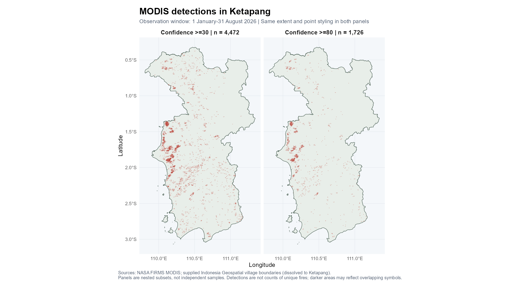
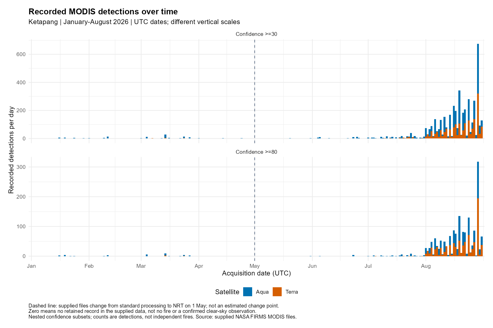
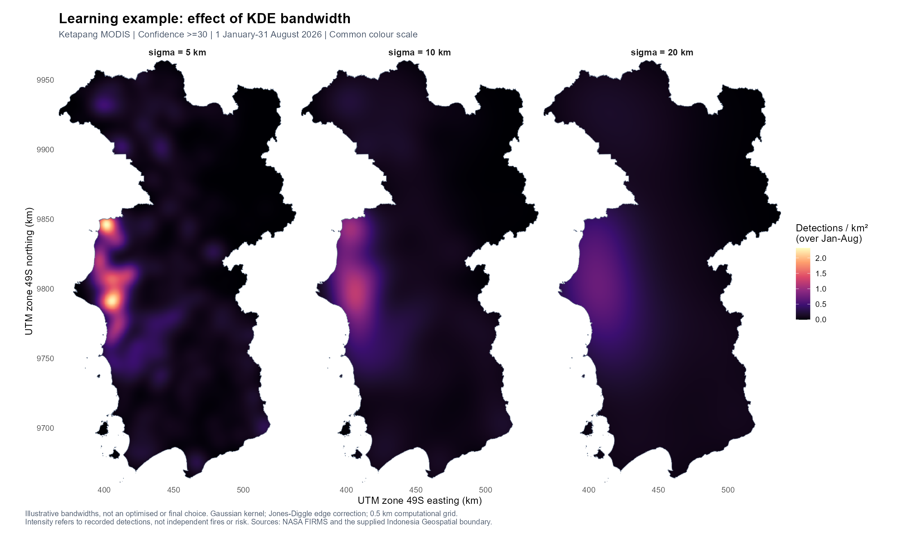
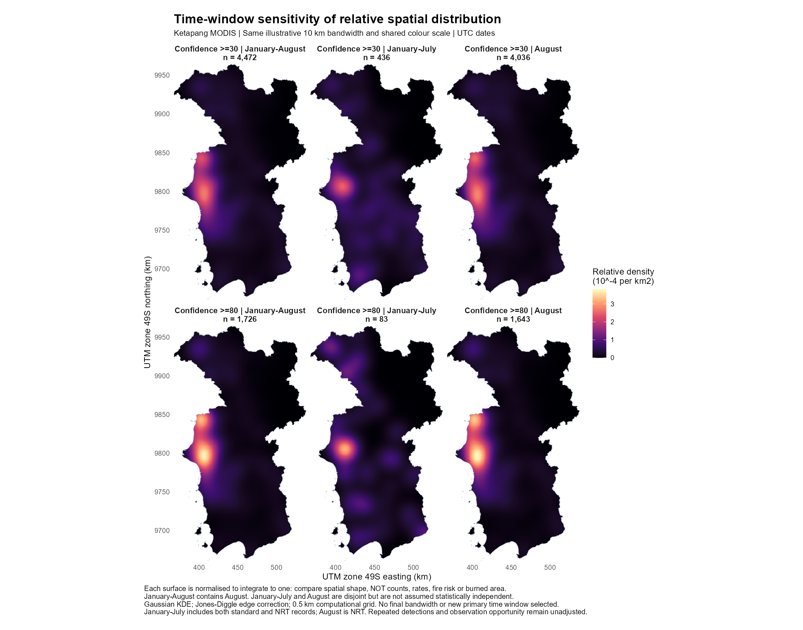
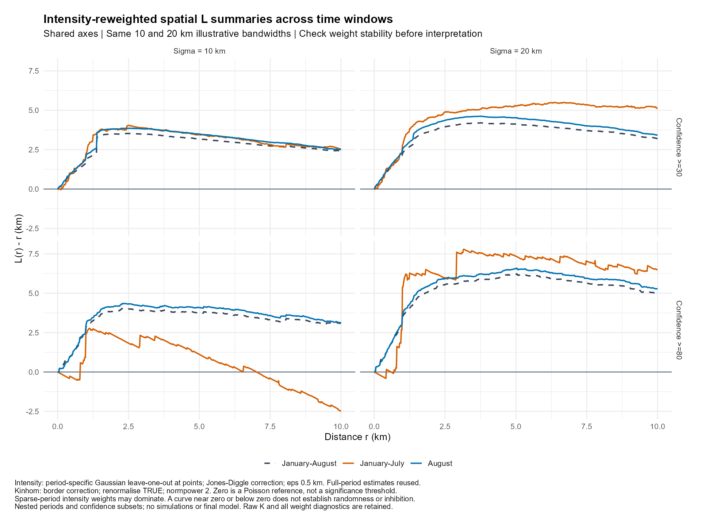
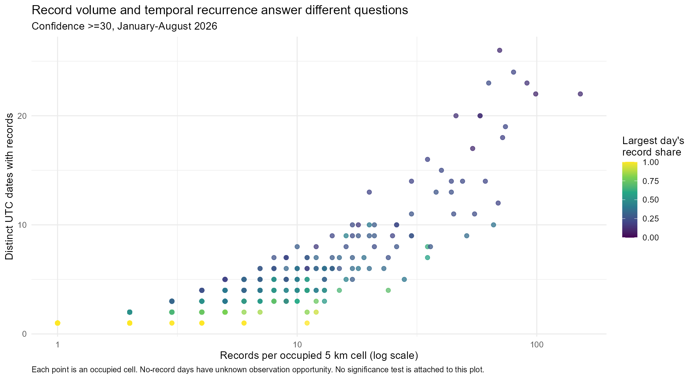
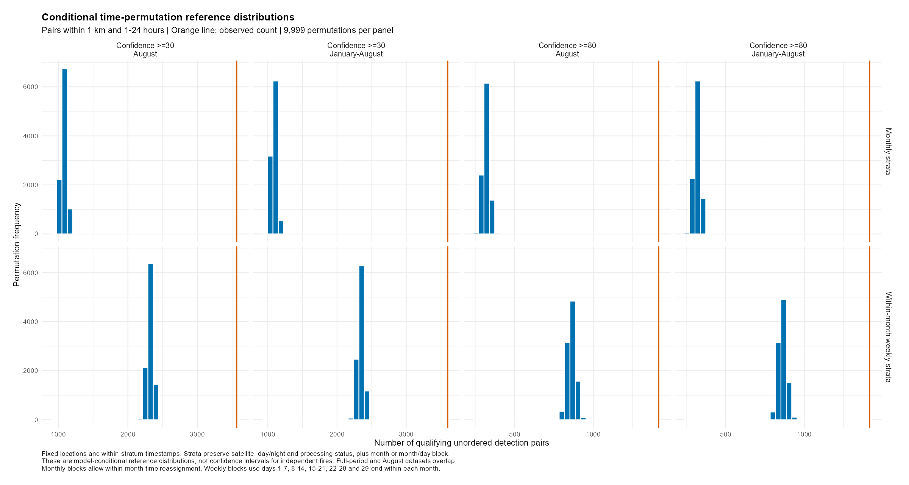

```{r}
#| label: setup
#| include: false
root <- "data/Ketapang"
temporal <- readRDS(file.path(root, "temporal_checks/temporal_diagnostics.rds"))
windows <- readRDS(file.path(root, "time_window_checks/time_window_diagnostics.rds"))
second <- readRDS(file.path(root, "time_window_second_order/time_window_second_order.rds"))
test <- readRDS(file.path(root, "permutation_tests/conditional_permutation_results.rds"))
day_test <- readRDS(file.path(root, "day_block_tests/day_block_results.rds"))
recurrence <- readRDS(file.path(root, "spatial_recurrence/spatial_recurrence.rds"))
audit <- readRDS(file.path(root, "robustness_extension/robustness_results.rds"))
source("robustness_figures.R")
assignment_audit <- reference_assignment_sensitivity(recurrence)
day_test$earlier_tests$p_current <- audit$previous_p_holm_192[1:72]
day_test$summary$p_current <- audit$previous_p_holm_192[73:144]
input_hashes <- unname(tools::md5sum(file.path(root,
  c("ketapang_boundary.gpkg", "ketapang_modis_2026_conf30.csv", "ketapang_modis_2026_conf80.csv"))))
for (result in list(test, day_test, recurrence, audit)) {
  stopifnot(identical(unname(result$source_md5), input_hashes))
}
primary <- subset(day_test$earlier_tests, distance_km == 1 & max_gap_hours == 24)
main <- subset(primary, subset == "Confidence >=30" & period == "January-August")
monthly <- main[main$scheme == "Monthly strata", ]
weekly <- main[main$scheme == "Within-month weekly strata", ]
fmt <- function(x, digits = 0) formatC(x, format = "f", digits = digits, big.mark = ",")
pformat <- function(x) formatC(x, format = "f", digits = 4)
day_main <- subset(day_test$summary, subset == "Confidence >=30" & period == "January-August" & distance_km == 1 & max_gap_hours == 24)
day_strict <- subset(day_main, scheme == "Whole days within month blocks")
grid_main <- recurrence$cells[["Confidence >=30 | 5 | 0"]]
top_dates <- recurrence$top[1, ]
top_volume <- grid_main[which.max(grid_main$records), ]
```

# Summary

| Question | Main evidence | Interpretation |
|----|----|----|
| When are records concentrated? | August contains 90.25% of main-subset detections | Full-period summaries largely reflect August; eight months cannot establish a seasonal cycle |
| Is proximity greater than the conditional benchmark? | Association persists at 0/1/3/6-hour lower lags and under two three-day block alignments; final Holm p = 0.0192 across 192 comparisons | The tested observation-preserving models do not explain all proximity; independent-fire interaction remains unresolved |
| Where should records be checked? | Both examples qualify in 7/8 nominal settings, but no centre passes all 32 directional/grid combinations | Exact geographic screening is sensitive to grid support and boundary assignment; candidates need explicit sensitivity flags |

**Reading guide:** Read the first-order maps alongside the conditional pair test, then use the [geographic screening](#geographic-screening) to locate candidates. The integrated findings connect this evidence to follow-up actions. Detailed model specifications and complete comparisons are retained in the technical appendix.

The practical contribution is to distinguish locations with many detection records from locations recorded on many separate dates. The two maxima occur in different cells. Their mapped locations and sensitivity checks provide a transparent starting point for imagery review. Pair-based inference supplies complementary evidence of conditional association, while independent-fire identities and observation coverage remain unresolved.

# Introduction and research questions

This analysis examines recorded MODIS active-fire and thermal-anomaly detections in Ketapang Regency, West Kalimantan, during the available January-August 2026 observation period. The analytical unit is a **satellite detection record**, rather than a confirmed independent forest-fire incident. The distinction matters because a fire can persist across overpasses, a pixel can contain more than one fire, and some thermal anomalies can have other explanations.

The analysis addresses the following questions:

1.  How do the location and timing of recorded detections vary within the study window?
2.  How sensitive are descriptive spatial summaries to confidence filtering, bandwidth and time window?
3.  Does evidence of short-range time-location association persist when the null preserves complete daily detection patterns, rather than exchanging individual timestamps?
4.  Do areas with many records also have detections on many separate dates, and how could this distinction guide verification?

The third question is a conditional test of **time-location association**. It is different from testing whether independent fires follow a spatially inhomogeneous Poisson process. No result below establishes a causal fire-spread mechanism.

[Executive summary](executive_summary.html) · [Project repository](https://github.com/JUNCHENLI2026/ISSS626_GAA)

# Data and study design

## R packages and workflow

The preparation below uses the `sf` and `spatstat` workflow introduced in [Chapter 1](https://r4gdsa.netlify.app/chap01.html) and [Chapter 4](https://r4gdsa.netlify.app/chap04.html). Short code chunks expose the import, projection and point-pattern steps. The complete raw-data extraction and computational scripts remain in the appendix.

```{r}
#| label: load-analysis-packages
#| code-fold: false
library(sf)
library(dplyr)
library(ggplot2)
library(spatstat.geom)
library(spatstat.explore)
library(knitr)
```

Packages are installed before rendering rather than during the analysis. The separate `spatstat` modules provide the geometry and exploratory functions used here.

## Sources and provenance

| Input | Role and coverage | Important qualification |
|----|----|----|
| NASA FIRMS MODIS Collection 6.1 archive file | Standard-processing observations, January-April 2026 | Source file contains a `type` field |
| NASA FIRMS MODIS Collection 6.1 NRT file | Near-real-time observations, May-August 2026 | The supplied file lacks `type`; missing values remain missing |
| Supplied Indonesian village boundaries | Geographic selection and full Ketapang study window | The download page's 2024 title does not verify a 2024 boundary reference date |

The supplied NASA FIRMS request and completion emails confirm request **803220**, submitted and made ready for download on **10 September 2026**. The request specifies MODIS C6.1, Indonesia, CSV format and 1 January-31 August 2026. The request identifier matches both retained archive and NRT filenames. The email body records request time `2026-09-10 13:49:56` without a stated timezone, so no timezone conversion is inferred. This documents the acquisition request and availability date; the emails do not independently establish the later local file-transfer time. Personal email details are excluded from this report.

Original files are retained without modification. The administrative XML creation date is 28 May 2023, and the supplied metadata include a 2022 identifier. These dates are recorded rather than relabelled as a confirmed 2024 boundary vintage.

The main input sources are [NASA FIRMS archive downloads](https://firms.modaps.eosdis.nasa.gov/download/) and the [Indonesia Geospatial boundary page](https://www.indonesia-geospasial.com/2023/05/download-shapefile-batas-administrasi.html). NASA's [MODIS attribute definitions](https://firms.modaps.eosdis.nasa.gov/descriptions/FIRMS_MODIS_Firehotspots.html) identify coordinates as pixel centres and acquisition times as UTC. The reported `scan` and `track` dimensions vary, so a fixed centre-to-centre distance does not establish overlapping pixel footprints.

## Spatial and temporal windows

**Provenance status:** NASA request and download-availability dates are supported by the supplied confirmation emails. The boundary's effective administrative date remains unverified. A webpage title or file modification date cannot resolve that boundary metadata gap.

The geographic window is the union of 262 village polygons whose supplied attributes identify Ketapang in West Kalimantan. Holes and disconnected components are retained. Geometry validity and union consistency are checked, but they do not independently verify administrative completeness. The derived projected area is approximately 29,997 km² and is not presented as an official area statistic.

Coordinates are transformed from WGS 84 to UTM zone 49S (EPSG:32749) and rescaled to kilometres for distance-based analysis. The temporal window is **1 January through 31 August 2026, inclusive, in UTC**. The geographic extraction begins on 14 January; the earliest detection in either confidence-filtered analytical subset is on 16 January. A date with no record does not demonstrate either absence of fire or an available cloud-free observation.

## Point-event definition and filtering

One row is one retained MODIS detection. Selection uses the supplied geographic window without inferring physical-fire identities. The main subset uses confidence ≥30, with confidence ≥80 as a nested sensitivity subset. These thresholds assess sensitivity to the confidence filter; they do not convert confidence into a calibrated probability of an independent fire.

The thresholds follow the nominal/high class boundaries in NASA's [MODIS Collection 6 and 6.1 Fire User Guide](https://www.earthdata.nasa.gov/s3fs-public/2023-09/MODIS_C6_C6.1_Fire_User_Guide_1.0.pdf): low is below 30, nominal is 30 to below 80, and high is 80 or above. The main subset includes nominal and high records; the stricter subset retains high records only. This is a product-confidence sensitivity comparison, not independent event verification.

```{r}
#| label: data-inventory
inventory <- data.frame(
  Dataset = c("All confidence levels", "Confidence >=30", "Confidence >=80"),
  Records = c(4738L, temporal$overview$records),
  Purpose = c("Geographic extraction and audit", "Main recorded-detection analysis", "Nested confidence sensitivity")
)
knitr::kable(inventory, format.args = list(big.mark = ","))
```

The source-row identifiers are unique. Neither retained confidence subset contains repeated numeric coordinates or duplicated latitude/longitude/acquisition-date/acquisition-minute/satellite keys. Exact-key uniqueness does **not** rule out repeated observation of the same physical fire. Records outside the study boundary are excluded from the analytical subset but remain in the original downloads. No temporal thinning, event merging, coordinate jitter, intensity flooring or weight capping is applied.

Original field text, including leading zeros in acquisition times, is preserved. `source_file`, `source_row` and `data_status` retain provenance. Blank NRT `type` values are not replaced by the standard-file category zero. The data therefore do not establish that every NRT record represents vegetation or forest fire.

All 46,449 source rows passed checks for finite numeric coordinates within valid longitude/latitude ranges, parseable dates and dates inside the requested observation period. No coordinate or date imputation was required. Acquisition dates and four-digit HHMM times in the analytical subsets were subsequently parsed and round-trip checked in UTC. Geographic extraction retained 4,738 records and excluded 41,711 from this study's output; original downloads remain intact. All 262 selected village geometries were valid before and after defensive `st_make_valid()` processing.

## Importing the prepared study window and detections

The following steps start from the retained Ketapang boundary and main confidence subset. They reproduce the analytical geometry used in the saved calculations; they do not repeat the national extraction or redefine the events. The CSV import preserves acquisition times as text so that leading zeros remain intact.

```{r}
#| label: import-prepared-spatial-data
#| code-fold: false
ketapang_sf <- st_read(
  file.path(root, "ketapang_boundary.gpkg"),
  layer = "study_window",
  quiet = TRUE
) |>
  st_transform(crs = 32749)

fire_records <- read.csv(
  file.path(root, "ketapang_modis_2026_conf30.csv"),
  colClasses = c(acq_time = "character")
)

fire_sf <- fire_records |>
  st_as_sf(coords = c("longitude", "latitude"), crs = 4326) |>
  st_transform(crs = 32749)
```

### Converting to `owin` and `ppp`

The observation window retains the supplied polygon's holes and components. Both the window and coordinates are expressed in kilometres, matching the distance thresholds and bandwidths used below. This adapts the course's point-pattern preparation to Ketapang's UTM zone 49S rather than carrying over Singapore's CRS.

```{r}
#| label: prepare-point-pattern
#| code-fold: false
ketapang_owin <- as.owin(ketapang_sf) |>
  rescale(s = 1000, unitname = "km")

fire_xy <- st_coordinates(fire_sf) / 1000
fire_ppp <- ppp(
  x = fire_xy[, "X"],
  y = fire_xy[, "Y"],
  window = ketapang_owin,
  checkdup = TRUE
)

stopifnot(
  npoints(fire_ppp) == 4472L,
  all(inside.owin(fire_xy[, "X"], fire_xy[, "Y"], ketapang_owin)),
  isTRUE(all.equal(
    unname(fire_xy),
    unname(temporal$subsets[["Confidence >=30"]]$xy_km)
  ))
)

data.frame(
  Object = c("Projected boundary", "Observation window", "Point pattern"),
  Class = c(class(ketapang_sf)[1], class(ketapang_owin)[1], class(fire_ppp)[1]),
  Unit = c("metres", "kilometres", "kilometres")
) |>
  kable()
```

The coordinate equality check confirms that this readable preparation produces the same locations as the saved analysis. No records are jittered, merged or removed to match a tutorial example.

# First-order patterns

First-order analysis describes how recorded intensity varies across location and time. It establishes the context for pair-based analysis: a dense area or a high-count month can generate many close pairs without demonstrating an additional interaction mechanism.

## Geographic distribution

{#fig-locations width="100%" fig-alt="Two Ketapang maps show 4,472 main-subset and 1,726 high-confidence detection locations, concentrated in parts of the west."}

The location maps describe an uneven distribution of retained records, with visible concentration toward parts of western Ketapang. The high-confidence subset contains fewer points and is nested within the main subset, so the two panels are not independent replications. Concentrated detections can reflect fire activity, persistent observations, land conditions or detection opportunity. This map alone does not identify their relative contributions or establish statistically significant interaction.

## Temporal concentration

{#fig-daily width="100%" fig-alt="Daily Terra and Aqua record counts rise sharply in August and peak on 29 August; a dashed line marks the May processing-status transition."}

August accounts for `r fmt(temporal$overview$august_percent[1], 2)`% of main-subset records and `r fmt(temporal$overview$august_percent[2], 2)`% of high-confidence records. Both subsets reach their highest daily recorded count on 29 August. This concentration means that full-period summaries largely describe late-period detections. The dashed line marks the supplied standard/NRT transition, not a fitted change point. Without information on cloud cover, overpass opportunity and data completeness, recorded counts cannot be interpreted as exposure-adjusted fire incidence.

## Spatial intensity and bandwidth

{#fig-kde width="100%" fig-alt="Kernel intensity maps compare 5, 10 and 20 kilometre bandwidths; wider bandwidths smooth local concentrations into broader areas."}

The same records appear more locally concentrated at 5 km and more broadly smoothed at 20 km. The shared colour scale shows intensity in recorded detections per square kilometre over the full period. These are descriptive estimates, not probabilities, daily risks or counts of independent fires. Bandwidth changes the spatial detail that the estimate retains and therefore requires a scientific justification beyond the appearance of the map.

### Estimation choices

All kernel calculations use the complete study window and Jones-Diggle edge correction. A 0.5 km computational grid controls raster approximation; it is not satellite resolution. Raw raster intensities are retained, and negligible negative FFT round-off is handled only for nonnegative plotting or unit-integral normalization. The [spatstat intensity documentation](https://search.r-project.org/CRAN/refmans/spatstat.explore/html/density.ppp.html) distinguishes intensity per unit area from probability density.

Earlier bandwidth checks compared likelihood cross-validation and the Cronie-van Lieshout criterion. Their implementations use different point-intensity and boundary conventions. Small likelihood-CV candidates produced severe reciprocal-weight concentration under the later leave-one-out estimator. The resulting numerical candidates are documented but are not automatically adopted as a final interaction model.

## Time-window sensitivity

{#fig-period-maps width="100%" fig-alt="Unit-integral maps compare January-July, August and the full period; August closely resembles the full-period spatial shape."}

Each panel integrates to one, permitting a comparison of spatial shape while removing total-count differences. Full-period and August maps have high overlap, partly because August dominates the full dataset. January-July and August are more distinct at this smoothing scale. The earlier window has only 436 main-subset and 83 high-confidence records, so its apparent detail has unequal evidential support. Normalized map overlap is descriptive and is not a test of temporal stability.

# Second-order spatial diagnostics

Ordinary and intensity-reweighted L summaries are evaluated on a common provisional 0–10 km distance grid with border correction. The reweighted estimator uses period-specific Gaussian leave-one-out intensity at the observation points, with illustrative bandwidths of 10 and 20 km, `renormalise = TRUE` and `normpower = 2`. Full-period estimates are reused after provenance checks.

{#fig-L width="100%" fig-alt="Intensity-reweighted L curves vary by period and bandwidth; the sparse early high-confidence subset is especially sensitive. No simulation envelope is displayed."}

The January-July high-confidence curve changes substantially between the two bandwidths. That subset contains only 83 records, and its maximum reciprocal-intensity share is 17.58% at 10 km versus 3.85% at 20 km. Only 55 centres remain eligible for border correction at a distance of 10 km. These diagnostics caution against interpreting a negative segment as evidence of inhibition. No simulation envelope has been fitted to these L curves.

The [inhomogeneous K documentation](https://search.r-project.org/CRAN/refmans/spatstat.explore/html/Kinhom.html) gives the Poisson theoretical reference. A reference line is not a significance threshold. Fitting intensity and then calculating a summary from the same observations makes estimation choices consequential. These curves motivate further investigation but do not themselves provide a formal spatial clustering conclusion.

# Conditional test of space-time association

## Research question and inferential scope

Do recorded detections occur close together in space and time more often than expected after preserving the observed spatial pattern and specified temporal structure? This is the report's formal **second-order spatio-temporal analysis**. It counts pairs of records, whereas the preceding intensity maps describe the distribution of individual records. The spatial L curves remain supporting diagnostics.

The primary statistic counts unordered record pairs at most **1 km apart and 1–24 hours apart**. The 1 km distance describes pixel-centre proximity. It cannot identify independent fires, particularly because the supplied scan dimensions reach 4.82 km. The lower lag removes near-simultaneous pairs without proving independence.

**Null:** Time labels, complete days or complete three-day patterns are exchangeable within their declared temporal strata. **Alternative:** The observed number of close pairs exceeds the conditional benchmark. Observed locations and the study window remain fixed, so the test concerns the retained in-window records; it cannot recover pairs involving unobserved events outside the boundary.

## Why compare conditional models?

| Model | What remains intact | Remaining assumption |
|---|---|---|
| Individual timestamps | Locations and stratum-specific time distributions, with satellite, day/night and processing status retained in the grouping | Exchanging individual records can disrupt shared overpasses and continuing fires |
| Complete UTC days | Every location, clock time and satellite label within each date | Days are exchangeable within the declared month or week blocks; midnight can split sequences |
| Complete three-day blocks | Internal order and observations within consecutive three-day patterns | Blocks are exchangeable within months; longer sequences and block joins remain unresolved |

The complete-day design addresses dependence that individual permutations break. Three-day blocks then check whether the conclusion persists when short sequences remain intact. Neither extension establishes equal cloud cover or valid-observation opportunity. Both alignments of three-day blocks are reported, with incomplete fragments fixed.

Each case uses **9,999 permutations**, a fixed seed and a one-sided plus-one p-value, including ties. Holm correction covers the full **192-comparison exploratory family**. Sensitivity checks vary confidence, period, distance, upper lag, lower lag and block alignment. Nested subsets and overlapping periods are sensitivity checks, not independent replications. Exact settings, implementations, Monte Carlo intervals and historical adjustments appear in the technical appendix.

## Results: association persists under stricter conditioning

```{r}
#| label: main-final-model-comparison
current_models <- audit$summary |>
  filter(
    subset == "Confidence >=30",
    period == "January-August",
    lower_hours == 1
  )

comparison <- current_models |>
  select(
    `Conditional model` = scheme,
    `All pairs` = observed,
    `Fixed pairs` = guaranteed_fixed,
    `Variable observed` = variable_observed,
    `Variable null mean` = variable_null_mean,
    `Holm p` = p_holm_192
  )
knitr::kable(comparison, digits = c(0, 0, 0, 0, 2, 4), row.names = FALSE)
```

```{r}
#| label: fig-main-model-comparison
#| fig-cap: "Pair enrichment depends on the temporal structure preserved by the null."
#| fig-alt: "Total-pair and variable-pair ratios are shown separately for daily and two three-day reassignment models."
#| fig-width: 12
#| fig-height: 5
plot_pair_denominators(audit)
```

**Interpretation.** All three models retain the same 3,597 observed pairs, but the daily model fixes 1,946 pairs and the three-day models fix 3,037 or 3,129. The daily model's remaining 1,651 pairs exceed its simulated mean of `r fmt(current_models$variable_null_mean[current_models$scheme == "Daily within week"], 2)`, giving a variable-component ratio of `r fmt(current_models$variable_ratio[current_models$scheme == "Daily within week"], 2)`. All displayed tests have final Holm p = 0.0192. This supports conditional time-location association under the tested models. Because each model leaves a different component free to vary, its ratio answers a different question; the ratios cannot be compared as a common fire-risk effect.

## What survives the sensitivity checks?

All 48 final-audit comparisons remain significant after adjustment across the complete 192-test family. Changing the lower lag from zero to one hour removes 1,022 pairs in the main dataset, all from the fixed component. The three-day designs leave only 560 or 468 observed pairs free to vary. Their significance therefore concerns the remaining conditional arrangement, rather than every pair.

The strongest supported conclusion is that **the recorded arrangement is inconsistent with the tested exchangeability models**. Persistent fire observations, changing coverage and dependencies across block boundaries remain possible explanations. These results do not establish causal spread, independent-fire interaction or local hotspot significance. The next section localises descriptive candidates for verification rather than assigning the global p-value to individual places.

# Spatial recurrence and geographic interpretation {#geographic-screening}

## Value-added question: volume or recurrence?

High pixel-record volume and repeated recording across many dates can imply different verification priorities. This extension asks whether the same areas rank highly on both measures. It adds an explicit space-by-date summary to the pair analysis without assuming that neighbouring observations constitute independent fires.

Each record is assigned to a square grid in UTM zone 49S. The main grid uses 5 km cells with origin (0, 0); the analysis repeats at 10 km and with a half-cell shift in both axes. Within each occupied cell, it counts records, distinct UTC dates, distinct months and the fraction of records on the busiest date. These are descriptive counts. Neither calendar days nor cell area supplies a valid-observation denominator. Partial border cells and changes of grid origin affect comparability.

## Volume and recurrence

{#fig-recurrence-comparison width="100%" fig-alt="Across occupied 5 kilometre cells, record counts and recorded dates are associated, but the 152-record maximum and 26-date maximum occur in different cells."}

The main 5 km grid has 621 occupied cells, including 225 with records on only one date. Record volume and recorded-date count are strongly associated descriptively (Spearman correlation 0.916), yet their maxima differ. The busiest cell contains 152 records on 22 dates; the cell with the most recorded dates contains 70 records on 26 dates. Thus ranking solely by record totals can miss areas that repeatedly appear across dates. The correlation is descriptive and has no attached independence-based p-value.

```{r}
#| label: fig-recurrence-map
#| fig-cap: "Geographic context of the highest-volume and highest-recurrence cells."
#| fig-alt: "Label A locates the 152-record cell in the Matan Hilir Utara context. Label B locates the 26-date cell in the Matan Hilir Selatan context."
#| fig-width: 11
#| fig-height: 8
source("recurrence_map.R")
recurrence_location_map(recurrence)
```

Cell A is E400_N9845 and cell B is E405_N9785. The map outlines the full grid cells, while the subdistrict names describe their modal record assignments rather than exclusive administrative ownership.

Repeated recording is concentrated in parts of western Ketapang. The leading cell by recorded dates is associated with Matan Hilir Selatan through its modal point-level subdistrict assignment. Its 26 recorded dates fall to 13 under the stricter confidence filter. This reduction shows that the recurrence count depends on filtering. Grey areas have no retained records, but may lack valid observations. Cells indicate where to inspect sequences; they do not define significant hotspots or identify ignition sites.

```{r}
#| label: recurrent-locations
top <- recurrence$top[1:5, c("cell_label", "district", "records", "recorded_dates", "high_confidence_dates")]
names(top) <- c("5 km cell", "Modal subdistrict of records", "Records >=30", "Dates >=30", "Dates >=80")
knitr::kable(top, row.names = FALSE)
```

Cell identifiers encode the lower-left easting/northing in projected kilometres, for example E405_N9785. Subdistrict labels describe the most frequent point assignment within each cell, not the exclusive administrative ownership of the entire square. All records map to exactly one of the 20 subdistrict unions derived from the supplied village attributes. The geometry and names inherit the source's uncertain effective vintage.

## Administrative context: counts and recurrence tell different stories

```{r}
#| label: district-context-comparison
context <- recurrence$administration
context <- context[context$subset == "Confidence >=30" & context$WADMKC %in% c("Matan Hilir Selatan", "Matan Hilir Utara", "Kendawangan"), ]
context <- context[match(c("Matan Hilir Selatan", "Matan Hilir Utara", "Kendawangan"), context$WADMKC), ]
context <- context[, c("WADMKC", "area_km2", "records", "recorded_dates")]
names(context) <- c("Subdistrict", "Derived area km²", "Detection records", "Recorded dates")
knitr::kable(context, digits = c(0, 1, 0, 0), row.names = FALSE)
```

Matan Hilir Selatan has the largest record total among these examples, while Kendawangan has more recorded dates despite fewer records. Their substantially different areas prevent a simple count-based risk ranking. This administrative comparison complements the cell-level A/B contrast: concentrated record volume and repeated appearance over time answer different monitoring questions. The table uses the supplied boundary attributes, whose effective administrative vintage remains uncertain. Neither area nor calendar dates measure valid satellite observation opportunity.

## Scale sensitivity and administrative context

```{r}
#| label: grid-sensitivity
grid_table <- recurrence$summary[, c("subset", "cell_km", "shift_fraction", "occupied_cells", "cells_one_date", "max_recorded_dates", "spearman_records_dates")]
names(grid_table) <- c("Subset", "Cell width km", "Origin shift / width", "Occupied cells", "One-date cells", "Maximum dates", "Spearman correlation")
knitr::kable(grid_table, digits = c(0, 0, 1, 0, 0, 0, 3), row.names = FALSE)
```

The main-subset maximum changes from 26 dates in the primary 5 km grid to 29 after a half-cell shift, and to 32 or 37 in the 10 km grids. Coarser cells pool more locations, so these increases are partly consequences of spatial support. The extension therefore reports sensitivity rather than claiming grid-independent hotspots. The purpose is to distinguish recorded volume from recurrence and provide auditable candidate locations for verification.

## Geographic stability on a common reference support

Raw maxima cannot establish stability because changing grid size changes the unit being ranked. The new audit therefore holds **621 primary occupied-cell centres** fixed and identifies the containing cell in each of the eight confidence/grid settings. Within each setting, cells are ranked by recorded-date count. A centre qualifies when its containing cell is in the highest 10%, using the maximum rank for ties so equally ranked cells are not arbitrarily split. A centre without a retained containing cell does not qualify. The 10% threshold was fixed before examining this audit, and is a descriptive screening rule rather than an estimated optimum.

Cell assignment uses half-open intervals: include the lower easting/northing edge and exclude the upper edge. Primary centres fall on vertices of the half-shifted 5 km grid, so this convention assigns them to the north-east cell. A supplementary assignment audit evaluates all four combinations of +/-1 metre easting and northing around each centre under all eight settings. This tests boundary conventions, not MODIS geolocation accuracy. Independent rectangle-inequality checks reproduce the floor-based assignment counts.

```{r}
#| label: geographic-anchor-audit
anchor_table <- audit$anchors[, c("reference_cell", "setting", "dates", "upper_rank_percent", "top_decile")]
anchor_table$reference_cell <- ifelse(anchor_table$reference_cell == "80_1969", "A: E400_N9845", "B: E405_N9785")
names(anchor_table) <- c("Reference location", "Setting", "Recorded dates", "Upper rank %", "Top 10%")
knitr::kable(anchor_table, digits = 2, row.names = FALSE)
```

Both A and B qualify in **7 of 8** settings. Both fail under the shifted 5 km high-confidence setting: A falls to an upper rank of 24.26% and B to 13.31%. Their geographic neighbourhoods remain useful candidates, but the exact primary-cell ranking is not invariant. Across all reference centres, 11 qualify in every setting and 479 qualify in none. These counts refer to the selected reference support, not the proportion of Ketapang's land area or independent fire incidents.

The directional audit materially qualifies that result: **no reference centre qualifies in all 32 direction-by-setting combinations**. A and B each qualify in seven or eight settings depending on direction. Thus the 11 nominal all-setting centres must not be called assignment-invariant hotspots. Their list remains useful for transparent checking, but every candidate requires a spatial-support sensitivity flag. An areal-overlap analysis would answer a different question about zones and has not been performed.

The following list identifies the 11 nominal all-setting candidates. Coordinates are primary-cell centres in UTM zone 49S, in kilometres. The district is the modal assignment of the primary cell's records, not verified ownership of the centre. The list is for imagery review, not field navigation or dispatch, and is sensitive to the directional check above.

```{r}
#| label: consistent-reference-locations
stable_locations <- subset(audit$support, settings_in_top_decile == 8)
stable_locations$district_context <- grid_main$district[match(stable_locations$cell, grid_main$cell)]
stable_locations <- stable_locations[, c("cell", "x_km", "y_km", "district_context", "settings_in_top_decile")]
names(stable_locations) <- c("Reference cell ID", "Easting km", "Northing km", "District context", "Qualifying settings")
knitr::kable(stable_locations, digits = 1, row.names = FALSE)
```

```{r}
#| label: fig-grid-stability
#| fig-cap: "Consistency of recurrence screening across eight confidence/grid settings."
#| fig-alt: "Reference-centre map highlights 11 centres meeting the top-decile screen in all eight settings."
#| fig-width: 11
#| fig-height: 8
plot_grid_stability(audit, recurrence)
```

The outlined centres meet the nominal screen under both confidence filters, cell sizes and origins. None passes all directional checks, so the outline indicates conditional screening agreement rather than a stable zone. Settings share records and provide no independent confirmation. Centres of clipped border cells may lie outside the boundary. Agreement depends on the 10% rule and assignment convention, with no local significance or risk interpretation.

# Integrated findings, uncertainty and implications

## Findings supported by these calculations

| Evidence | What it adds | Appropriate follow-up |
|----|----|----|
| Daily counts and KDE | Timing and geographic concentration of recorded detections | Inspect August imagery and western recording concentrations |
| Conditional pair tests | Excess short-lag proximity relative to specified reassignment models | Compare candidate sequences with overpass and incident records |
| Grid recurrence | Separates many records from repeated appearance on different dates | Compare highlighted cells A and B before assigning operational priority |

First-order concentration supplies the context for the pair tests, rather than independent confirmation of their significance. The recurrence analysis localises descriptive candidates, but the global conditional p-value does not assign significance to either highlighted cell.

The observed detections are temporally concentrated in August and are spatially uneven. Spatial-shape and L summaries depend on the time window and smoothing choice. The conditional permutation analysis finds more short-distance, short-time detection pairs than expected under the individual-record and whole-day designs, after adjustment across the full threshold family.

The final significance conclusion is narrow: **the recorded time-location arrangement is inconsistent with the specified individual-record, whole-day and three-day-block exchangeability models**, with Holm-adjusted p = 0.0192 across the final 192-test family. Lower-lag and block-alignment checks do not change this decision. The fixed and variable pair components differ between models, so their ratios cannot be compared as a common ecological effect. The analysis does not isolate ecological interaction from persistent detections or observation-process structure, and does not validate the L curves as formal tests.

The recurrence extension supplies a complementary geographic interpretation. High-volume and frequently recorded areas overlap broadly, but their maxima differ and their summaries depend on confidence and spatial support. Together, the analyses support targeted verification of observed sequences rather than ranking future fire probabilities. This directly answers the four research questions: the distribution is uneven, August dominates, conditional time-location association persists under the added models, and record volume alone does not fully describe geographic recurrence.

## Important limits

- A row represents a detected thermal-anomaly pixel, not a verified independent forest-fire incident. NRT records lack the supplied standard-file `type` classification.
- Individual timestamp permutations can disrupt dependence among records belonging to the same overpass or continuing fire. Whole-day permutations preserve within-date dependence but still assume date exchangeability and can split sequences at UTC midnight. A one-hour cutoff does not identify independent incidents.
- No cloud-free observation, coverage or exposure denominator is available. The standard/NRT transition and confidence filtering affect comparability.
- The supplied administrative boundary has uncertain effective vintage and has not been independently checked against an authoritative current regency boundary.
- Thresholds, windows and the successive block designs follow exploratory inspection. Holm correction covers the final 192 tests but cannot reverse data-driven choices or repair a misspecified null. Three-day blocks preserve local order only within their boundaries. Grid agreement is descriptive and depends on the 10% screen and reference support.
- P-values address the stated models. They do not quantify fire severity, burned area, causality or operational benefit.

## Public-safety planning and management

The results support a verification workflow rather than immediate resource allocation. A regional monitoring team could first examine the large late-August recording episodes, including 29 August, against source imagery and confirmed incident reports. Each candidate review should record acquisition date, satellite, location, image availability and whether independent incident evidence corroborates the detection sequence. An unavailable or cloudy image should remain inconclusive rather than count as evidence of no fire.

The recurrence screen provides a second entry point. Review the 11 reference centres meeting the nominal top-decile criterion in all eight settings, alongside illustrative cells A and B. Every candidate should carry a spatial-support flag: none passes all directional checks, and A and B vary between seven and eight qualifying settings. Compare corroboration and inconclusive-image rates between these descriptive groups before using them operationally. No such external validation has yet been performed, so the candidates are not verified incidents, significant local hotspots or deployment priorities.

Before converting either pattern into planning recommendations, agencies would need observation-coverage information, suitable-date land cover, incident identities, assets at risk and operational capacity. The present analysis supplies none of those denominators or causal links. No recommendation to build a station, relocate crews or attribute fires to a particular land use follows directly from the results.

The practical contribution is an auditable way to separate a large number of detected pixels from repeated appearance over time. This can help organize follow-up checks while keeping uncertainty visible. The eight-month retrospective sample cannot establish future fire probability or the effectiveness of any intervention.

# Reproducibility

The project preserves the source downloads, geographic subset, provenance columns, intermediate diagnostics, scripts and calculation objects. Large national boundary files remain local rather than being embedded in Git history. The derived Ketapang boundary and input detection subsets are sufficient to rerun the analyses after extraction; independently reproducing the extraction also requires the original national boundary and NASA files described in `data/Ketapang/README.md`.

The principal computational stages and their purposes are:

| Stage | Functions or operations | Purpose |
|----|----|----|
| Geographic extraction | `sf::st_read`, `st_zm`, `st_transform`, `st_make_valid`, `st_union`, `st_intersects` | Build the unsimplified study window and retain in-window detections |
| Confidence subsets | Numeric `confidence >= 30` and `confidence >= 80` filters | Compare a main subset with a nested stricter subset while preserving provenance |
| Point-pattern objects | `spatstat.geom::as.owin`, `ppp` | Use a polygon observation window and projected kilometre coordinates |
| First-order intensity | `spatstat.explore::density.ppp` | Describe spatially varying recorded-detection intensity at stated bandwidths |
| Spatial second-order diagnostics | `Kest`, `Kinhom`; transform to `sqrt(K/pi) - r` | Examine descriptive pair structure and sensitivity to estimated intensity |
| Conditional time-label test | Projected pair distances, `sample`, custom lag counts, `stats::p.adjust` | Compare close-pair counts with restricted time permutations and adjust the declared test family |

The data README lists the scripts, dependencies, output files and checks for each stage. The report's inference uses the last stage; the spatial K/L diagnostics are not substituted for a fitted simulation test.

The report reads verified calculation objects. Rendering alone does not rerun the 279,972 original, whole-day and final-audit permutations. For a complete rebuild from the supplied raw downloads, use the exercise-root `reproduce.R` entry point with an **unused output directory**:

``` powershell
Rscript reproduce.R "E:/JUNCHENLI/ISSS626_GAA/Take-Home_Ex/Take-Home_Ex01" "C:/path/to/new-build" "E:/quarto/bin/quarto.exe"
```

Replace paths with the local exercise directory, a new writable destination and the installed Quarto executable. The raw NASA files and national boundary must be present in their documented locations. Required R packages include sf, dplyr, ggplot2, spatstat.geom, spatstat.explore, knitr and rmarkdown. The runner checks dependencies and refuses to reuse an existing destination. It rebuilds the extraction, reconciles confidence-subset rows with the retained inputs, runs all diagnostic and inferential stages, executes independent verification, and renders the report and summary. Step logs and session information are written under the new build's `logs/` directory. It does not delete data, publish a site, commit or push.

For a faster render from existing results, render the two QMD documents without running the rebuild script. The distinction between regenerating analysis and rendering saved analysis is explicit. Detailed dependencies and source-data restrictions remain documented in the data README.

The labelled recurrence map is generated during rendering by `recurrence_map.R`, using the saved grid and district geometries. Assertions verify the two displayed record/date counts before plotting. It changes presentation without altering the statistical results. The complete rebuild copies this helper alongside both documents. NASA acquisition-request metadata are supported by the supplied emails; boundary vintage remains an outstanding provenance check. Successful rendering does not resolve it.

Source and previous-result hashes were checked before and after computation. An independent verification enumerated all spatial pairs from projected coordinates, reconciled observed counts, checked three stored permutations per case, recomputed all p-values and independently reconstructed the Holm step-down adjustment. Figures were inspected after rendering.

# Technical appendix

The appendix retains complete specifications and earlier comparison families for reproducibility. The main findings use the final 192-test adjustment throughout.

## Detailed conditional-test specifications and sensitivity results

Two complementary randomization designs are reported. The original design exchanges individual timestamps within strata. The added design moves each complete observed UTC-day pattern to another eligible date while preserving every location, satellite label and time of day within that pattern. Both are explicit conditional models with different assumptions; neither is asserted to be a verified model of independent fire incidents.

### Rationale and hypotheses

The spatial diagnostics show why a homogeneous random-location benchmark would ignore important variation in the observed pattern. The following test instead holds all observed locations fixed and randomizes time labels within declared strata. This conditions on the observed spatial pattern rather than estimating a new spatial intensity surface for inference.

**Null hypothesis:** Within each declared stratum, acquisition timestamps are exchangeable among the observed record locations. Conditional on those margins, the assignment of times to locations contains no additional association.

**Alternative:** There are more nearby, temporally close detection pairs than expected under this conditional reassignment model.

This is a restricted-permutation adaptation of a [Knox-type close-pair test](https://search.r-project.org/CRAN/refmans/surveillance/html/knox.html). The custom statistic counts unordered pairs satisfying both `distance <= d` and `1 hour <= elapsed time <= h`. The lower bound excludes simultaneous and near-simultaneous records from the statistic, but does not prove separate physical events or independent satellite passes. It differs explicitly from an unmodified upper-threshold-only Knox statistic.

### Parameters and assumptions

| Decision | Specification | Reason and limitation |
|----|----|----|
| Spatial thresholds | 0.5, 1 and 2 km | Retains the previously inspected sensitivity range; centres are not fire footprints |
| Temporal thresholds | Upper bounds of 6, 24 and 72 hours; lower bound 1 hour | Assesses short-lag proximity without same-minute pairs |
| Main reassignment strata | Month × satellite × day/night × processing status | Preserves these spatial/time margins |
| More restrictive sensitivity | Adds within-month blocks of days 1–7, 8–14, 15–21, 22–28 and 29–end | Conditions on finer temporal changes; final blocks are shorter |
| Datasets | Confidence ≥30 and ≥80; January-August and August | Four nested/overlapping datasets, not independent replications |
| Randomizations | 9,999 per dataset/stratification combination | Fixed before inspecting randomization results |
| Tail and threshold | One-sided excess-pair test; alpha = 0.05 | Tests enrichment, not inhibition |
| Multiple comparisons | Original 72, whole-day 72 and final robustness 48 comparisons in a 192-test Holm family | Covers the declared family, not unrecorded prior exploration |

The central assumption is **record-level timestamp exchangeability within strata**. Shared overpasses, persistent fires, spatially varying cloud cover and changing observation opportunity can undermine a physical-fire interpretation. Restricting permutations controls selected margins but does not validate this assumption. Conditioning on fixed locations preserves the observed boundary geometry and spatial inhomogeneity. It does not produce an edge-unbiased space-time K estimate or an unconditional fire-risk model.

The January-August comparison is displayed at 1 km and 1–24 hours for continuity with the earlier data audit. The thresholds and August window were considered after inspecting the data, so the results remain exploratory rather than prospectively confirmatory.

### Computation and reproducibility

Within each stratum, timestamps are sampled without replacement. The same randomized timestamps are used for all nine threshold combinations in that run. Singleton groups and groups with only one distinct timestamp remain unchanged. Seeds are fixed from 2026091701 through 2026091708, with the R random-number, normal and sampling algorithms recorded in the source script.

The Monte Carlo p-value is `(1 + exceedances) / (9999 + 1)`, where ties count as exceedances. The smallest possible reported value is 0.0001, never zero. This follows [Phipson and Smyth](https://arxiv.org/abs/1603.05766). The [Holm procedure](https://stat.ethz.ch/R-manual/R-devel/library/stats/html/p.adjust.html) now covers all 192 comparisons. Main-text tables use this final family. The appendix retains historical 72- and 144-test adjustments for traceability.

```{r}
#| label: calculation-summary
tab <- main[, c("scheme", "observed_pairs", "permutation_mean", "observed_to_null_mean", "p_mc", "p_current")]
names(tab) <- c("Time strata", "Observed pairs", "Null mean", "Observed / null mean", "Monte Carlo p", "Holm p (192)")
knitr::kable(tab, digits = c(0, 0, 2, 2, 4, 4), row.names = FALSE)
```

The main dataset contains **`r fmt(monthly$observed_pairs)` qualifying pairs**. The monthly null mean is **`r fmt(monthly$permutation_mean, 2)`**, giving an observed/null-mean ratio of **`r fmt(monthly$observed_to_null_mean, 2)`**. With the more restrictive time blocks, the mean increases to **`r fmt(weekly$permutation_mean, 2)`** and the ratio decreases to **`r fmt(weekly$observed_to_null_mean, 2)`**. The ratios describe close-pair enrichment; they are not fire-risk ratios or numbers of excess independent events.

### Reference distributions and significance

{#fig-permutations width="100%" fig-alt="Eight permutation histograms show the observed close-pair count above all 9,999 simulated values in each displayed individual-record reassignment model."}

Observed counts lie above every simulated count in each displayed 1 km/1–24-hour comparison. The more restrictive strata increase the reference means, showing that temporal grouping materially changes the benchmark, but observed counts remain higher. Each Monte Carlo p-value is 0.0001 at the chosen simulation resolution, and each final-family Holm-adjusted value is 0.0192. The distributions describe the conditional randomization model rather than uncertainty in a count of independent fires.

The main null hypotheses are rejected at the 5% level under both stratum definitions. The supported conclusion is **statistically significant time-location association of the recorded MODIS detections relative to the stated conditional models**. Rejection does not establish independent-fire clustering, causal spread, ignition mechanisms or deficiencies in an operational response.

### Sensitivity results

```{r}
#| label: sensitivity-table
sens <- primary[, c("subset", "period", "scheme", "observed_to_null_mean", "p_current")]
names(sens) <- c("Confidence subset", "Period", "Time strata", "Observed / null mean", "Holm p (192)")
knitr::kable(sens, digits = c(0, 0, 0, 2, 4), row.names = FALSE)
```

All 72 original comparisons have Monte Carlo p = 0.0001 and final-family Holm-adjusted p = 0.0192. Identical p-values reflect the finite simulation resolution, not identical effect sizes. The detailed simulated means, standard deviations, observed counts, upper-tail exceedances and Monte Carlo tail-probability intervals are retained in the calculation object. Full-period and August results overlap, and confidence ≥80 is nested within ≥30; these are sensitivity checks rather than eight independent confirmations.

The implementation records two-sided 95% binomial Monte Carlo intervals for the permutation tail probability. They describe numerical uncertainty in that tail probability, not a confidence interval for an ecological effect. More permutations would improve tail resolution but would not resolve exchangeability, event-definition or observation-opportunity limitations.

The historical adjustments were 0.0072 for 72 tests and 0.0144 for 144 tests. The final integrated conclusion uses the 192-test family, with adjusted p = 0.0192. Increasing the family changes the adjustment even when the underlying historical calculations remain unchanged.

### Observation-preserving sensitivity design

#### Why preserve complete days?

At the primary 1 km/1-24-hour setting, `r fmt(day_strict$fixed_within_day_pairs)` of `r fmt(day_strict$observed_pairs)` pairs (`r fmt(100 * day_strict$fixed_within_day_pairs / day_strict$observed_pairs, 1)`%) have both endpoints on the same UTC date. Individual time-label permutations can break this structure. The new design deliberately fixes every within-day spatial and temporal arrangement, so its random variation concerns the ordering of complete daily patterns and their cross-date proximity.

This does not require identifying true satellite orbits from timestamps. A UTC day is an explicitly chosen calendar block, not an orbit, a local-calendar day, or an independent fire. Groups spanning UTC midnight remain a limitation. The method conditions on observed daily patterns and does not infer cloud-free observation opportunities.

#### Null hypothesis and implementation

The null states that complete observed daily patterns are exchangeable among the calendar dates within each time stratum. A permutation applies the **same date mapping to every record on a given UTC date**, across both satellites and day/night categories. Acquisition clock times and coordinates remain unchanged. All 243 calendar dates, including dates with no retained record, participate in the full-period permutation. Empty days represent empty recorded patterns, not verified fire-free or fully observed days.

The two schemes exchange complete days within a month or within that month's blocks of days 1-7, 8-14, 15-21, 22-28 and 29-end. Month membership preserves the supplied processing-status transition. The stricter scheme retains shorter-term changes in the observed daily pattern distribution. Neither scheme preserves the full original temporal sequence; that is precisely the structure being tested. Changing clouds, observation geometry or other short-term factors can still violate daily exchangeability.

The distance/time grid, confidence subsets, periods and 9,999 permutations per case remain unchanged. Seeds are 2026091901-2026091908. These 72 comparisons joined the original 72 in the intermediate 144-test family. All now also enter the final 192-test family below. The extensions are exploratory, not retroactively pre-registered analyses.

#### Parameter decisions

The scales address different questions. The 0.5-2 km pair distances bracket kilometre-scale pixel-centre proximity, whereas 5-20 km KDE bandwidths describe broader geographic concentration. Neither defines a physical fire footprint. The 6-72 hour upper lags compare short and multi-day associations without estimating fire duration. Agreement across these exploratory choices supports only the tested range.

The final robustness audit below varies the earlier one-hour lower lag and preserves three consecutive days in each movable block. Month restrictions still do not establish equal cloud cover or observation opportunity. Independent coverage information remains unavailable, so the extensions evaluate specified alternatives rather than validating exchangeability.

| Decision | Analytical purpose | Boundary on interpretation |
|----|----|----|
| 1 km display, with 0.5 and 2 km sensitivities | Examine proximity around MODIS's nominal kilometre-scale product | Supplied scan dimensions reach 4.82 km; centres and footprints differ. These thresholds cannot classify unique incidents |
| 1-hour lower lag | Remove simultaneous and near-simultaneous pairs from the statistic | It does not establish independence between overpasses or fires |
| 6, 24 and 72-hour upper lags | Compare subdaily, approximately daily and multi-day proximity | Exploratory temporal scales, not estimated fire durations or calibrated spread windows |
| Whole UTC-day blocks | Preserve every within-date observed arrangement | UTC boundaries can split a real observation sequence; the daily date mapping remains an assumption |
| 5/10/20 km descriptive KDE | Show how smoothing affects the apparent pattern | These are illustrative scales. No optimal ecological interaction bandwidth is claimed |
| 5/10 km recurrence grids and half-cell shifts | Compare repeated geographic recording at coarser support than the close-pair thresholds | Grid units are aggregation choices rather than event boundaries or satellite footprint reconstructions |

#### Revised results

```{r}
#| label: preserved-day-table
day_tab <- day_main[, c("scheme", "observed_pairs", "fixed_within_day_pairs", "null_mean", "observed_to_mean", "p_mc", "p_current")]
names(day_tab) <- c("Whole-day reassignment", "Observed", "Fixed within-day pairs", "Null mean", "Observed / mean", "Monte Carlo p", "Holm p (192)")
knitr::kable(day_tab, digits = c(0, 0, 0, 2, 2, 4, 4), row.names = FALSE)
```

```{r}
#| label: fig-null-comparison
#| fig-cap: "Total-pair and reassignable-component ratios under three conditional models."
#| fig-alt: "Two panels distinguish total-pair ratios from ratios after removing model-specific fixed pairs."
#| fig-width: 12
#| fig-height: 5
plot_pair_denominators(audit)
```

The panels separate all qualifying pairs from the component that can change under reassignment. Fixing longer sequences increases the fixed baseline, so a total ratio near one can coexist with a larger variable-component ratio. The models test different conditional questions. The figure does not estimate a common ecological effect or rank the models by correctness. Each displayed test has final-family Holm p = 0.0192.

#### Expanded test family and the ratio denominator

All 72 whole-day comparisons have final-family Holm-adjusted p = 0.0192. Their unadjusted values are not all identical: 69 equal 0.0001, one equals 0.0003 and two equal 0.0004. Equal adjusted values do not imply identical evidence or effect sizes.

Under the stricter whole-day model, the variable cross-date component is 1,651 observed pairs against a simulated mean of 991.63, a ratio of 1.66. The total-pair ratio of 1.22 includes the 1,946 pairs fixed in every permutation. Both descriptions refer to the same test, but the ratios have different denominators. Comparing total-pair ratios between null designs therefore illustrates conditioning sensitivity, not a single invariant ecological effect size.

#### Influence of high-record dates

The primary full-period count contains 685 pairs touching 29 August, the largest daily contribution. Omitting all records on that date would leave 2,912 qualifying pairs, a 19.04% decrease. This is an arithmetic influence diagnostic, not a new significance test: removing a date changes the null reference as well as the observed statistic. No records are removed from the reported analyses, and no date is selected for deletion to improve a p-value. Pair contributions across dates must not be added because cross-date pairs appear in two date-specific contributions.

### Final audit: lower lags and continuous three-day patterns

The audit addresses two specific weaknesses: the earlier fixed one-hour exclusion and the loss of dependence across neighbouring dates. It holds distance at 1 km and upper lag at 24 hours, comparing lower lags of 0, 1, 3 and 6 hours. It evaluates both confidence subsets and both periods. These settings were fixed before inspecting this extension's outputs, but follow the earlier exploratory analysis and are not an independent confirmatory study.

Alongside daily reassignment within the original week blocks, two new schemes permute complete three-day blocks **within each month**. The first starts on day 1, the second on day 2. Incomplete leading/trailing fragments remain at their original dates. Every full block retains its internal order, clock times, locations and empty recorded dates. Month boundaries and joins between blocks can still interrupt real sequences. Exchangeability of complete blocks remains an assumption; preserving three days does not account for longer persistence or measured cloud coverage.

There are 12 dataset/model cases, each with 9,999 permutations and four lower-lag statistics: 48 comparisons. Four daily one-hour settings repeat earlier primary questions and remain in the correction as conservative duplicates. The final family contains **192 comparisons**, rather than selectively dropping repeated or unfavourable results. Seeds are 2026092301-2026092312. The plus-one calculation includes ties. Saved binomial intervals quantify Monte Carlo tail-probability uncertainty, not uncertainty about fire risk.

```{r}
#| label: final-block-results
final_main <- subset(audit$summary, subset == "Confidence >=30" & period == "January-August" & lower_hours == 1)
block_table <- final_main[, c("scheme", "observed", "guaranteed_fixed", "variable_observed", "variable_null_mean", "p_holm_192")]
names(block_table) <- c("Model", "All pairs", "Fixed pairs", "Variable observed", "Variable null mean", "Holm p (192)")
knitr::kable(block_table, digits = 4, row.names = FALSE)
```

All 48 added comparisons remain significant after the full correction, with adjusted p = 0.0192. This supports robustness to the tested lower lags and preservation of three-day sequences. It does not establish general robustness to all dependence structures. At the main one-hour setting, the three-day models fix 3,037 or 3,129 of 3,597 pairs, leaving only 560 or 468 in the reassignable observed component. Their significance concerns this residual conditional arrangement, not every observed pair.

```{r}
#| label: lower-lag-summary
lag_table <- subset(audit$summary, subset == "Confidence >=30" & period == "January-August")
lag_table <- lag_table[, c("scheme", "lower_hours", "observed", "guaranteed_fixed", "variable_ratio", "p_holm_192")]
names(lag_table) <- c("Model", "Lower lag h", "All pairs", "Fixed pairs", "Variable ratio", "Holm p (192)")
knitr::kable(lag_table, digits = 4, row.names = FALSE)
```

Changing the lower lag from zero to one hour removes 1,022 observed pairs in the main dataset, all from the fixed component in these models. The observed counts at one and three hours coincide; six hours removes further pairs. Thus unchanged significance does not mean the event definition is irrelevant. The audit separates what the cutoff changes in the data from what the chosen randomization can test. Independent all-pairs calculations verify observed counts and three saved permutations per case; a separate implementation reconstructs the 192-test Holm adjustment.

## Connection to the course methods

[Chapter 5](https://r4gdsa.netlify.app/chap05.html) introduces spatial K/L summaries and simulation envelopes. Here, ordinary and intensity-reweighted summaries diagnose spatial structure, while the declared conditional permutation tests provide formal spatio-temporal inference. A default CSR envelope would change the reference model and would not be an interchangeable code simplification.

[Chapter 6](https://r4gdsa.netlify.app/chap06) provides the fire-detection space-time context. This report retains exact UTC acquisition times for its close-pair statistic. Replacing that test with a monthly marked point pattern or a space-time density estimate would answer a different question. The block-permutation and recurrence extensions are documented separately from the course examples.

## Extraction and diagnostic implementations

The folded sources below expose the processing choices behind the figures, not only the presentation code. The rebuild entry point also shows how the confidence subsets are constructed. Scripts run as separate stages; rendering this page displays their source without rerunning them. Raw national data are not embedded in the page.

```{r}
#| echo: false
#| results: asis
sources <- c("filter_ketapang.R", "plot_data_checks.R", "learning/kde_learning.R",
  "second_order_diagnostics.R", "inhomogeneous_diagnostics.R", "weight_leverage_audit.R",
  "bandwidth_selector_checks.R", "temporal_repeat_checks.R", "time_window_comparison.R",
  "time_window_second_order.R")
for (f in sources) {
  cat("<details><summary>", f, "</summary>\n\n```r\n",
    paste(readLines(file.path(root, f), warn = FALSE), collapse = "\n"),
    "\n```\n\n</details>\n\n", sep = "")
}
cat("<details><summary>reproduce.R: complete rebuild entry point</summary>\n\n```r\n",
  paste(readLines("reproduce.R", warn = FALSE), collapse = "\n"),
  "\n```\n\n</details>\n\n", sep = "")
cat("<details><summary>recurrence_map.R: labelled geographic evidence</summary>\n\n```r\n",
  paste(readLines("recurrence_map.R", warn = FALSE), collapse = "\n"),
  "\n```\n\n</details>\n\n", sep = "")
```

## Permutation implementation

```{r}
#| label: implementation-source
#| echo: false
#| results: asis
code <- readLines(file.path(root, "conditional_permutation.R"), warn = FALSE)
cat("<details><summary>Complete R implementation</summary>\n\n```r\n", paste(code, collapse = "\n"), "\n```\n\n</details>\n", sep = "")
```

## Original tests with both adjustment families

```{r}
#| label: complete-tests
#| echo: false
#| results: asis
cat("<details><summary>All 72 original comparisons: historical and expanded adjustments</summary>\n\n")
all_tab <- day_test$earlier_tests[, c("subset", "period", "scheme", "distance_km", "max_gap_hours", "observed_pairs", "permutation_mean", "p_mc", "p_holm_72", "p_holm_144")]
print(knitr::kable(all_tab, digits = c(0, 0, 0, 1, 0, 0, 2, 4, 4, 4), row.names = FALSE))
cat("\n\n</details>\n")
```

## Added implementations and expanded test results

```{r}
#| echo: false
#| results: asis
for (f in c("day_block_permutation.R", "spatial_recurrence.R", "verify_revision.R")) {
  cat("<details><summary>", f, "</summary>\n\n```r\n", paste(readLines(file.path(root, f), warn = FALSE), collapse = "\n"), "\n```\n\n</details>\n\n", sep = "")
}
cat("<details><summary>All 72 additional whole-day comparisons</summary>\n\n")
print(knitr::kable(day_test$summary[, c("subset", "period", "scheme", "distance_km", "max_gap_hours", "observed_pairs", "fixed_within_day_pairs", "null_mean", "p_mc", "p_holm_144")], digits = 4, row.names = FALSE))
cat("\n\n</details>\n")
```

The original-test table presents the historical 72-family and revised 144-family adjustments side by side. The saved `day_block_results.rds` contains `earlier_tests$p_holm_144`, the recalculated adjustment for all earlier tests under the expanded family. All earlier adjusted values become 0.0144. No old results are overwritten or silently presented as independent replications.

## Final audit source and complete results

The following sources and tables document all 48 added comparisons, including repeated primary settings. The final Holm correction includes them all. Earlier result files remain unchanged; the report derives the current adjustments from `robustness_results.rds`.

```{r}
#| echo: false
#| results: asis
for (f in c(file.path(root, "robustness_extension.R"), file.path(root, "verify_robustness.R"), "robustness_figures.R")) {
  cat("<details><summary>", basename(f), "</summary>\n\n```r\n",
    paste(readLines(f, warn = FALSE), collapse = "\n"), "\n```\n\n</details>\n\n", sep = "")
}
cat("<details><summary>All 48 final-audit comparisons</summary>\n\n")
print(knitr::kable(audit$summary[, c("subset", "period", "scheme", "lower_hours", "observed", "guaranteed_fixed", "null_mean", "variable_ratio", "p_mc", "p_holm_192")], digits = 4, row.names = FALSE))
cat("\n\n</details>\n")
```

# References

- Kam, T. S. *R for Geospatial Data Science and Analytics*: [Chapter 1: Geospatial Data Science with R](https://r4gdsa.netlify.app/chap01.html), [Chapter 4: First-order Spatial Point Patterns](https://r4gdsa.netlify.app/chap04.html), [Chapter 5: Second-order Spatial Point Patterns](https://r4gdsa.netlify.app/chap05.html), and [Chapter 6: Spatio-Temporal Point Patterns](https://r4gdsa.netlify.app/chap06). Accessed 27 September 2026.

- NASA FIRMS. [Archive downloads](https://firms.modaps.eosdis.nasa.gov/download/) and [MODIS attribute definitions](https://firms.modaps.eosdis.nasa.gov/descriptions/FIRMS_MODIS_Firehotspots.html).
- Indonesia Geospatial. [Administrative-boundary download page](https://www.indonesia-geospasial.com/2023/05/download-shapefile-batas-administrasi.html). Source metadata qualifications are documented above.
- spatstat authors. [Kernel intensity estimation](https://search.r-project.org/CRAN/refmans/spatstat.explore/html/density.ppp.html) and [inhomogeneous K](https://search.r-project.org/CRAN/refmans/spatstat.explore/html/Kinhom.html).
- Meyer, S. and surveillance contributors. [Knox test documentation](https://search.r-project.org/CRAN/refmans/surveillance/html/knox.html), including references to Knox, Mantel and Meyer et al.
- Phipson, B. and Smyth, G. K. (2010). [Permutation p-values should never be zero](https://arxiv.org/abs/1603.05766).
- R Core Team. [Multiple-comparison adjustments](https://stat.ethz.ch/R-manual/R-devel/library/stats/html/p.adjust.html), including Holm (1979).
- ISSS626. [Take-home Exercise 1 requirements and AI-use policy](https://isss626-ay2026-27aug.netlify.app/take-home_ex01).
